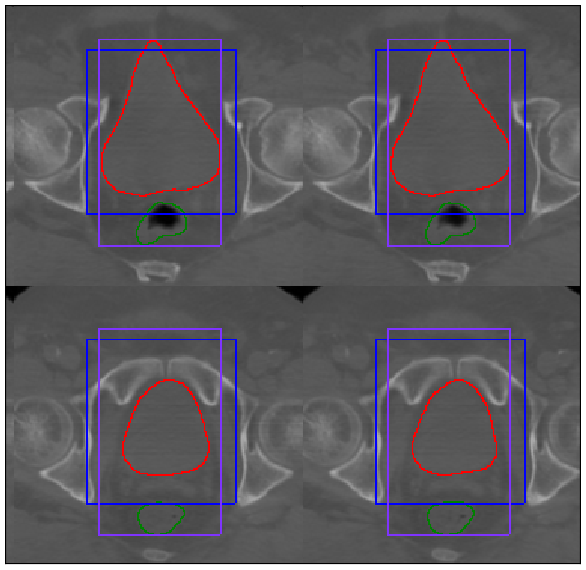

# Organs detection in CT and CBCT using deep learning for radiotherapy applications

## Description

This repository contains the files that were used for my master thesis.
The aim of the methods defined in this repositroy is to detect organs (bladder, rectum, prostate) in CT and CBCT scans of the male pelvic area and extract a bounding box containing all of them. This repositroy contains two distinct classes of algorithms : the classical computer vision based methods (split_segmentaion) and the learning based method (pelvis_yolo). Both are described in below.

--------------------------------------------------------------------------------

## Deep learning based method

This code was adapted from https://github.com/allanzelener/YAD2K and modified to recognize bladder, prostate and rectum on pelvic CT and CBCT scan images.

YAD2K is a 90% Keras/10% Tensorflow implementation of YOLO_v2.

Original paper: [YOLO9000: Better, Faster, Stronger](https://arxiv.org/abs/1612.08242) by Joseph Redmond and Ali Farhadi.

### Requirements

- [Keras](https://github.com/fchollet/keras)
- [Tensorflow](https://www.tensorflow.org/)
- [Numpy](http://www.numpy.org/)
- [Pillow](https://pillow.readthedocs.io/) (For rendering test results.)
- [Python 3](https://www.python.org/)

### Usage

To use this code on your own data, start by creating a 'pelvis_scan/data' folder inside the 'split_segmentation' folder of this repository. Then split your data set into three folders named 'train', 'test' and 'val' inside 'pelvis_scan/data/'. Each folder must contain an annotation file with the bounding box annotations stored as a .p python dictionary with the name 'annotations_{train, test or val}.p'. When that is done, a few steps are required depending on what you want to do with the model. If you want to use weights from pre-trained model, you must create a 'models' directory and store the '.h5' files there.

#### Train the model

Start by running the 'make dataset' command. This will transform your .p annotation file into a .npz file directly usable by the network. then run the 'make train' command from training the model. If you want to load the weights of a previously trained model, add 'WEIGHTS={weights file name}' and the model will automatically start the training from where it was left off.

#### Run predictions with the model

Run the 'make pred WEIGHT={weights file name} SET={train,val or test} FILE={name of the .npz file corresponding to the set}', the npz file has to be in the same folder as the data. The results will be saved as a series of '.p' files in the 'results/' folder.

#### Evaluate  the model

Run the 'make eval WEIGHT={weights file name} SET={train,val or test} ANNOT_FILE={name of the .p file corresponding to the data}', the p file has to be in the same folder as the data. The results will be saved as a series of '.p' files in the 'results/' folder.

#### Save the output images with bounding boxes drawn on them

Run the 'make draw SET={train,val or test} ANNOT_FILE={name of the .p file corresponding to the data}', the p file has to be in the same folder as the data. The results will be saved as a series of '.p' files in the 'results/' folder.

#### Predict, evaluate and save the resulting images all at once.

Run the 'make analysis WEIGHT={weights file name} STAGE_DIR={name of the folder where the results will be saved} FILE={name of the .npz file corresponding to the set} ANNOT_FILE={name of the .p file corresponding to the data}'. The results will be stored in 'stages/{SET}/{STAGES_DIR}/'.

--------------------------------------------------------------------------------

## Classical computer vision methods

The split_segmentation folder contains the files for split and merge segmentation and split and crop segmentation methods applied to pelvis Cone Beam CT scans, as well as utility files to plot and analyse the results.

### Usage

To use this code on your own data, start by creating a 'data' folder inside the 'split_segmentation' folder of this repository. Then add two files to the data folder : 'image.npy' and 'mask.npy' of shape (192,192,160) and (192,192,160,3). 'mask.npy' contains three segmentation masks (bladder, rectum and prostate) of ones (if the organ belongs to the mask) and zeros (if it does not).

Once this is done, you can run the command line scripts to display the results of the different algorithms on this particular image.

- run_merge.sh : runs the split and merge segmentation method on the image. Then saves the result as 'merged_image.npy' and displays it.
- run_crop.sh : runs the split and crop segmentation method on the image. Then saves the result as 'cropped_image.npy' and displays it (along with the ground truth bounding box containing all the organs).
- run_spamcrop.sh : runs the split and merge segmentation method on the image and feeds the result as input of the split and crop segmentation method. Then saves the result as 'cropped_image.npy' and displays it (along with the ground truth bounding box containing all the organs).

The ground truth bounding box is displayed in blue and the predicted box in purple. A piece of the results you should obtained after running each file is displayed below.

